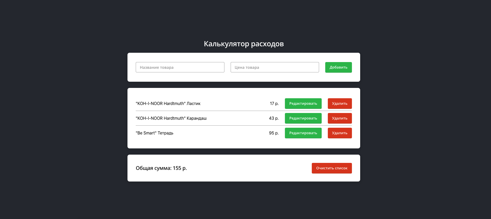

### Задание:
Необходимо создать интерфейс "Калькулятор расходов" на JS-библиотеке React. Код нужно разместить в репозитории на github.com и настроить в нём Pages для демонстрации результата. 

#### Дизайн:

#### Техническое задание:

Интерфейс представляет собой список товаров, в котором можно добавлять/удалять/изменять товары.

- Для хранилища списка необходимо использовать localStorage. То есть после обновления страницы список должен так же отображаться.
- Текстовое поле "цена товара" принимает только числовые значения с точностью до второго знака, если это число с плавающей запятой.
- "Общая сумма" это сумма всех цен товаров из списка.
- При добавлении/удалении/изменении элемента списка, должна обновляться "общая сумма" и сам список товаров.
